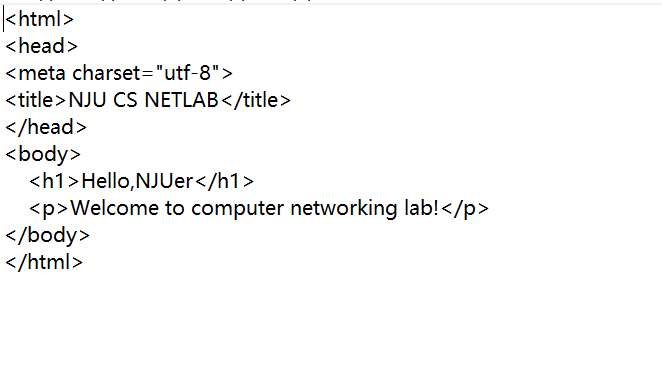

Nginx安装与配置

### 安装
安装nginx： 
`sudo apt-get install nginx` 
查看nginx服务状态： 
`sudo systemctl status nginx`

更改防火墙配置： 
`sudo ufw allow 'Nginx Full'`

此时如果访问该网站的ip地址，应该会有下图： 

将域名指向本机: 
`sudo vim /etc/hosts`

添加域名： 
`127.0.0.1 netlab4njucs.top`

### 配置

建立存放网站的文件夹： 
`sudo mkdir /var/www/NJUCS_Web/pub_html`

在其中放入网页html文件，如`index.html`，比如我们的html文件如下： 

接下来修改配置文件，使得外部能够访问到我们自己的html文件： 
`sudo vim /etc/nginx/sites-enabled/default` 
修改`root`后面的内容，使其指向存放网页文件的文件夹: 
`root /var/www/NJUCS_Web/pub_html;` 
修改`index`后面的内容，使其指向网页文件: 
`index index.html;` 
配置文件default最终看上去：

server { 
&emsp;listen&emsp;80; 
&emsp;listen&emsp;[::]:80; 
&emsp;root&emsp; /var/www/NJUCS_Web/pub_html/; 
&emsp;index&emsp; index.html; 
&emsp;server_name netlab4njucs.top; 
&emsp;access_log /var/log/nginx/access.log; 
&emsp;error_log /var/log/nginx/error.log; 
&emsp;location / { 
  &emsp;&emsp;  try_files $uri $uri/ =404; 
&emsp;  } 
}

保存关闭后查看配置文件是否有语法错误： 
`sudo nginx -t`

最后重启Nginx服务： 
`sudo systemctl restart nginx`

此时用ip或者域名来访问，得到如下图： 

